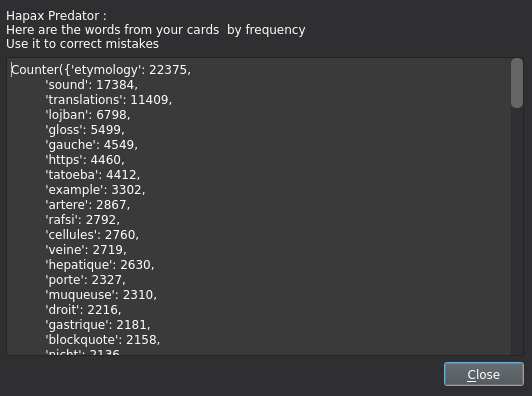

# Hapax Predator
* Acknowledgement : an unlimited amount of thanks go to Glutanimate, his Qt code in the addon [Batch Editing](https://ankiweb.net/shared/info/291119185) was what I needed to hack my way into a Qt window.

## In a few words :
* When summoned, the Hapax Predator will show you all the words found in the current selection of cards, ordered by frequency. This allows to find the least used words, which are propably misssssspelings.
* The words are separated using a small series of python scripts and will very probably missbehave because of accents and such, don't hesitate to open an issue in case anything goes wrong.
* If you make a modification to this code, please tell me so that I can (maybe) implement it for everyone else! Thank you! I don't know any QT and only python so don't hesitate!
* Please tell me if you find anything weird, especially because of languages, accents, encodings etc. That would be very appreciated!
    

### Know issues :
* Not really sure all the text preprocessing happens correctly as the final one is a catch all anyway. Someone with experience in text encodings is welcome as I'm note sure there's not some accentueted words that are not recognized but I don't really want to embed unicode into my code. Help appreciated.

### TODO :
* Waiting for user feedbacks. Suggestions are welcome, just open an issue.

## FAQ :
* **But WHY!** Fixing misspellings is a first step towards managing NLP tasks in anki. Stay tuned. Another use would be to help have better matching when using the great [Pop Up Dictionnary Addon](https://ankiweb.net/shared/info/153625306)
* **How can I use it ?** Open the browser > select cards > click on `Edit` then `Hapax Predator`
* **Why this name?** It's a play on words, an hapax is a word that appears only once in a text and an apex predator is the one on top of the food chain.
* **How can I install it?** Follow this link : https://ankiweb.net/shared/info/1495282885
* **Should I open an issue if X?** Of course please do, I am very eager to get feedbacks and am very early to all this.
* **What happenned to my accents?** I decided to ignore as many accents as possible (for example `é` got turned into `e`) because I create way too many cards to care about them.
